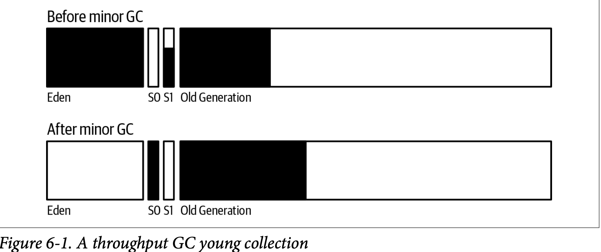
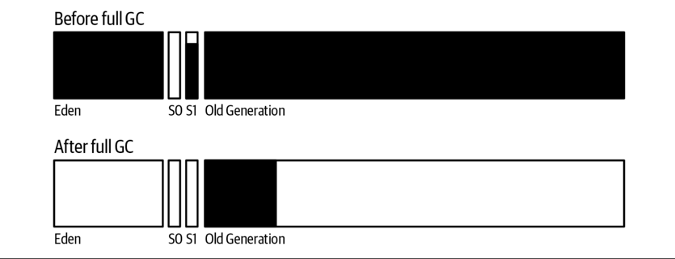
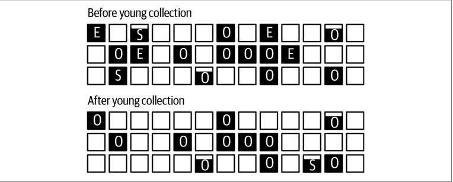
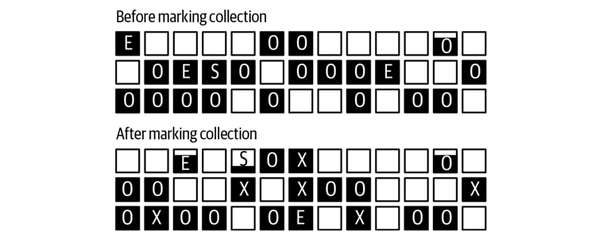
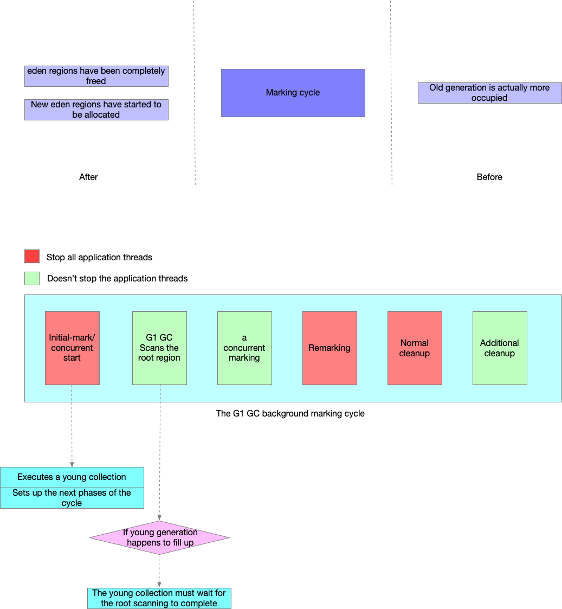

# Garbage Collection Algorithms
少数的异常情况会影响所有的GC算法：
* 大对象的分配（allocation of very large objects）
* 对象的存活时间不短不长（objects that are neither short-nor long-lived）

所有的收集器都有三个基本的操作：
1. 找到不再使用的对象（find unused objects）
2. 释放内存空间（free their memory）
3. 压缩堆内存（compact the heap）

## 理解Throughput Collector
### Young GC

当eden区被填充满触发young GC。移动所有Eden区对象，一些到survivor spaces，一些到old generation。

解读young GC日志信息：
```text
 17.806: [GC (Allocation Failure) [PSYoungGen: 227983K->14463K(264128K)]
                 280122K->66610K(613696K), 0.0169320 secs]
                 [Times: user=0.05 sys=0.00, real=0.02 secs]
```
227983K->14463K(264128K)：young generation大小为260MB，GC前young generation大小为227MB，GC后
大小为66MB。

280122K->66610K(613696K)：为整个堆在GC前后的变化。

### Full GC


### 自适应和静态设置堆大小
TPS会随着堆内存变大而增加，但是到达峰值后堆内存再增加TPS会下降。随着堆内存的变大，GC的时间也会

Full GC会清理幸存区的对象。
## 理解G1 Garbage Collector
G1 GC运行在堆内存中的离散区域。每一个区域都可以属于old or new generation，并且这些分带区域可以是
不连续的。这样的好处是G1 GC专注大多数是垃圾的区域，并且使用很少的时间清空这些区域这就是 garbage first
这个名字的由来。

G1 GC也被称为并发收集器因为标记老年代将要被释放的对象是和应用程序线程同时进行的。但也不是完全的并行
在标记和压缩青年带的时候需要暂停所有的应用程序，压缩老年代的时候也需要暂停所有的线程。

G1 GC有四种逻辑操作：
1. a young collection
2. a background, concurrent marking cycle
3. a mixed collection
4. if necessary, a full GC

### G1 GC Young Collection

Eden全部清空,如果survive

### G1 GC并发标记

在并发周期至少有一个年轻代集合，因为在标记周期前eden区域被完全释放，新的eden区域开始分配。有一些区域会被标记为X，这些区域属于
old generation，其中还包含数据，这些区域可以确定主要包含垃圾。

最后可以注意到在完成标记周期后old generation大多数都被占用，因为在标记周期中年轻代发生的收集将数据提升到老年代中。另外，
在标记周期中实际上不会释放任老年代的数据，仅仅是标记出大多数是垃圾的区域，这些区域的对象将在后面一次周期中清除。



