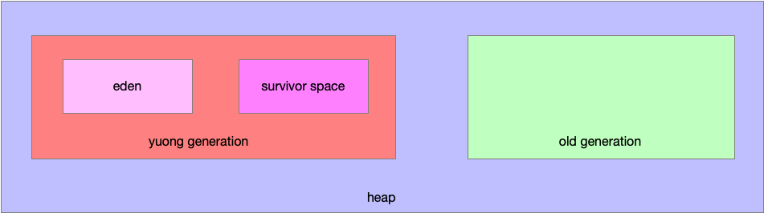

# Java Performance

## Introduction

### 通过两方面的知识来提升JAVA平台的性能

 The goal is to give you an in-depth understanding of the performance aspects of the Java platform.

This knowledge falls into two broad categories:

* the way that the JVM is configured affects many aspects of a program’s performance

* understand how the features of the Java platform affect per‐
  formance

**Knowledge of the complete sphere is what will give your work the patina of art.**

### Software containers

* **Virtual matchine**: that virtual machine is indistinguishable from a regular machine with two cores and 16 GB of memory.

* **Docker container**: Java comes with a rich set of tools for diagnosing performance issues. These are often not available in a Docker container.

### Premeaturely Optimize

```java
log.log(Level.FINE, "I am here, and the value of X is " + calcX() + 
" and Y is " + calcY());
```

以上的代码没有达到应该打印的日志级别，calcX()和calcY()方法也会被执行。最好的方式使用下面这种写法：

```java
if (log.isLoggable(Level.FINE)) { 
    log.log(Level.FINE,"I am here, and the value of X is {} and Y is {}",
            new Object[]{calcX(), calcY()});
}
```

the message fomate isn't necessarily more ecfficient, but it is cleaner

### Look Elsewhere: The Database Is Always the Bottleneck

As a general rule, when load is increased into a system that is overburdened, performance of that system gets worse. If something is changed in the Java application that makes it more efficient—which only increases the load on an already overloaded database—overall performance may actually go down.

### Optimize for the Common Case

* 代码优化重点关注对代码的分析

* 使用奥卡姆剃刀原则诊断(diagnosing)性能问题，首先应该怀疑的是代码bug

* Write simple algorithms for the most common operations in an application

## An Approach to Performance Testing

### Microbenchmarks must use their results

使用递归方式的fib方法来测算执行时间

```java
public class SkipCalculation {

    public static void main(String[] args) {
        int l;
        long then = System.currentTimeMillis();
        for (int i = 0; i < 2; i++) {
             l = Sum.fib(20);
        }
        long now = System.currentTimeMillis();
        System.out.println("first execute time " + (now - then));

        long then1 = System.currentTimeMillis();
        for (int i = 0; i < 2; i++) {
            l = Sum.fib(20);
        }
        long now1 = System.currentTimeMillis();
        System.out.println("second execute time " + (now1 - then1));
    }
}
```

执行的结果：

> Task :SkipCalculation.main()
> first execute time 2
> second execute time 1

java code is interpreted the first few times it is executed, it gets faster the longer it is executed

这里的没有在任何的地方读取，会被编译器优化跳过计算，可以将l修改为成员变量，这样可以准确的测量该方法的性能。In practice, changing the definition of l from a local variable to an instance variable (declared with the volatile keyword) will allow the performance of the method to be measured.

### Microbenchmark code may behave differently in production

快和慢是相对的，有的代码实现快但是会造成大量的短暂存活的对象在新生代，并进入老年代，最后导致频繁的full GC。

### Mesobenchmarks

Mesobenchmarks are also good for autemated testing, particularly at the module level.

## A Java Performance ToolBox

### CPU Usage

* user time

* system time

CPU的利用率通常可以分为两种类型，user time和system time。user time CPU执行应用 代码，system time CPU执行系统内核代码。system time 关联应用，例如程序执行IO操作，将执行内核代码读取磁盘上的文件，或者将缓冲区的数据写到network。

CPU空闲的原因：

* 死锁

* 等待数据库的响应

* 应用无事可做

### Java Monitoring Tools

#### jcmd

> 打印class，thread，JVM的基本信息

常用命令：

*uptime*

```shell
jcmd process_id VM.updtime
```

The length of time the JVM has been up can be found via this command.

*System properties*

```shell
jcmd process_id VM.system.propertes
```

相当于System.getProperties()

*JVM command line* 

```shell
jcmd process_id VM.command_line
```

*JVM tuning flags*

```shell
jcmd process_id VM.flags
```

VM的启动参数

#### jconsole

> 图表展示JVM的活动状态，线程、class的使用，GC的活动状况

#### jmap

> 堆信息dumps，JVM内存使用

#### jinfo

> 展示JVM的系统设置

#### jstack

> dumps 栈信息

#### jstat

> 提供GC和类加载信息

#### jvisualvm

> JVM监控图形工具

### Working with tunning flags

`-XX:+PPrintFlagsFinal`

设置的VM参数可能会相互影响，开启该参数后可以打印出所有的设置的VM flags和对映的值。

## Working with the JIT Complier

just-in-time即时编译器是Java虚拟机的心脏，没有其他的东西对应用程序的性能影响超过了JIT Compiler。

compiled languages和interpreted的差异：

`compiled languages`:

* 不能跨平，一次编译永久执行, 二进制文件

* 执行快

`interpreted`:

* 解释器翻译为一个与平台无关的中间代码

* 运行时需要源代码

java尝试找到一个中间的解决方案。

### HostSpot Compilcation

JVM在执行代码的时候不会李哥变异代码，有以下两个原因：

* 代码可能只会被执行一次，那么编译它基本上就是一种浪费，直接解释java字节码的速度比编译后执行代码的速度快

* 被JVM多次执行的方法和循环，当代码被编译的时候，JVM会拥有足够的信息来优化。
  
  > 例如`equals()` 方法当解释其遇到b = obj1.equals(obje2) 语句的时候，先要查找obj1的类型，才能知道哪一个equals()方法被执行。这种动态查找是很耗时的。通常JVM注意到每次改语句执行的时候obj1是String类型，JVM可以在编译的时候直接调用String的equals()方法。

-XX:-TieredCompilation使用分层编译参数。

### Common Compiler Flags

调校Code Cache参数

> JVM编译代码后，会将会变代码存入code cache，一旦code cache装满，JVM就不能再编译任何的代码。JVM会先预留code cache设置的内存空间不分配，但是会被预留。extra memory reservation will generally be accepted by the operating system.

### 编译代码的几种状态

`%`: OSR: on-stack replacement。当JVM确定了需要编译的方法，这个方法在队列中被替换。

`s`: 同步方法

`!`: The method has an exception handler.

`b`: 编译在阻塞模式下进行

`n`: 编译包装一个native 方法

### 分成编译的层级

`0`: Interpreted code

`1`: Simple C1 compiled code

`2`: Limited C1 compiled code

`3`: Full C1 compile code

`4`: C2 compile code

通常编译日志显示大多数方法编译的等级在level3。所有的方法开始都在level0,但是不会显示日志。如果一个方法京城的被执行，将会提升编译等级到level4，最常见的是，C1 compiler等待需要编译的代码直到有了如何使用这些代码的信息，利用这些信息来执行优化。

如果C2的队列满了，需要编译的方法将从C2的队列中拉去出来使用level2等级编译。

### 高级的编译器参数

**编译阀值**

> 主要因素是代码执行的频率，一旦达到了一定的执行次数就达到了编译阀值，编译器就认为有足够的信息编译代码

在当前的JVM中修改编译的阀值没有任何的作用。

在JVM中编译器基于两个计数器

* 方法被调用的次数

* 方法中循环向后分支的次数the number of times any loops in the method have branched back（branceing counter分支计数？）

当JVM执行代码的时候会检查这两个计数器的和来决定是否编译

修改编译阀值的参数在分层编译器中是失效的，在standard compilation可以通过`-XX:CompileThreshold=N`来修改。

**编译器线程数**

当一个方法达到了编译的要求，改方法会加入一个队列，这个队列被一个或多个后台的线程处理。这个队列不是严格的先进先出的队列，被执行次数高的方法具有较高的优先级。C1和C2编译器用不同的队列，也有不同的线程对其进行处理。

`-XX:CICompilerCount=N`调整编译线程的数量，设置编译线程数量的三分之一会被JVM用于处理C1编译的队列，剩余的线程会用于处理C2编译器的队列。CICompilerCount的默认值是基于CPU的数量，低版本的JDK在容器中使用需要注意。

`-XX:+BackgroundCompilation`设置线编译线程异步的处理队列。

### 内联方法

内联方法是编译器重要的一项优化，方法内联是指：在编译过程中遇到方法调用的时候，将目标方法的方法体纳入编译范围之中，并取代原有方法。

```java
public class Point { 

    private int x, y;

    public void getX() { 
        return x; 
    }

    public void setX(int i) { 
        x = i;
    } 
}
```

性能优化提示经常反对这种精细的封装，应为这些方法调用都很影响性能。

现在这些代码会被JVM优化，例如：

```java
Point p = getPoint();
p.setX(p.getX() * 2);
```

编译后的代码如下：

```java
Point p = getPoint();
p.x = p.x*2;
```

方法内联是默认开启的，可以使用-XX:-Inline参数关闭。

### 逃逸分析

`XX:+DoEscapeAnalysis`配置参数，默认为true。

```java
public class Factorial {
    private BigInteger factirial;
    private int n;
    public Factorail(int n) {
        this.n = n;
    }
    public synchronized BigInteger getFactorial() {
        if (factorial == null) {
            factorial = ...;
            return factorial;
        }
    }
}
```

存储100个factorial值在数组中，代码如下：

```java
ArrayList<BigInteger> = new ArrayList<BigInteger>();
for (int i = 0; i < 100; i++) {
    Factorial factorial = new Factorial(i);
    list.add(facotrial.getFactorial);
}
```

没有其他的代码可以访问factorial对象，JVM将做一下优化：

* 不需要sychronization lock在调用getFactorial()方法时。

* 不需要再内存中储存n，可以直接在寄存器中保存。

* 不需要分配很多的factirial对象，仅仅只追溯每个对象的各自独立的字段。

逃逸分析优化也可能导致bug，simpler code wile compile better.

### 分层编译器的取舍（Trade-offs）

* 在有限的内存环境中

### javac编译器

对javac编译器的几点误解：

1. 使用`-g`选项添加debugging信息不是影响性能

2. 使用`final`关键字不会提升编译速度

3. 新版本的javac不会使程序变快

## 垃圾回收器介绍

应用不能使用计数来动态的追踪，JVM必须定期的在堆中搜寻未使用的对象。这项工作会从GC roots开始, GC root对象是可以从堆外访问的。主要包括线程堆栈和系统对象。这些对象始终是可访问的，GC算法可以通过一个root对象扫描到所有可访问的对象。不可达的对象就被视为垃圾。

垃圾回收器的性能取决这些基本的操作：

* 找到不使用的对象

* 标记所占内存为可用的

* 压缩堆

GC在追寻对象引用或者在内存中移除对象的时候会确保应用线程没有使用这些对象。所有应用线程的暂停被称为`stop-the-world pauses`，通常这种暂停对应用程序的性能有巨大的影响，减少这种暂停的时间是GC调优重要的考虑方向。

### 常见的垃圾回收器

大多数垃圾回收器将堆内存分为不同的区



#### Young GC

当young generation被填充满后，垃圾回收器会停止所有的应用线程并清空young generation，不被使用的对象将被丢弃，继续使用的对象将被移动到另外一个地方。这种操作叫做minor G**C或者叫young GC。**

分代收集是在应用线程停止的频率和当堆空间填满时等待JVM的GC操作之间做权衡。

分代回收的两个优点：

* young generation只是堆内存的一个区间，执行回收操作会比对整个堆进行回收更快

* 对象在young generation的分配方，减少内存碎片

> The second advantage arises from the way objects are allocated in the young generation. Objects are allocated in eden (which encompasses the vast majority of the young generation). When the young generation is cleared during a collection, all objects in eden are either moved or discarded: objects that are not in use can be discarded, and objects in use are moved either to one of the survivor spaces or to the old generation. Since all surviving objects are moved, the young generation is automatically compacted when it is collected: at the end of the collection, eden and one of the survivor spaces are empty, and the objects that remain in the young generation are compacted within the other survivor space.

#### Full GC

`concurrent collectors`: **scan for unused objects can occur without stopping application threads.**

使用并发收集器应用程序会经历更短的暂停时间。最大的权衡在于程序总体上会占用跟多的CPU。

一个程序（REST server）是否使用并行收集器可以从以下几点来考虑：

1. 独立的请求被暂停时间影响，特别是full GC的长暂停。如果目标是最小化暂停对响应时间的影响，并发收集器是一个很好的选择。

2. 如果平均相应时间比一些异常值更重要，非并发的收集起更好。

3. 额外CPU使用开销带来避免长暂停的好处。如果你的机器缺乏并发收集器需要的CPU空闲周期，那么非并行收集器是更好的选择。

批处理应用程序权衡点：

1. 如果有足够可用的CPU资源，可以使用并发收集器避免full GC可以使任务更快的完成。

2. 因为CPU的限制，额外的CPU资源消耗到了并发收集器上会导致比处理任务时间变长。

### GC Algorithms

#### The serial grbage collector

The serial collector uses a single htread to process the heap.It will stop all application threads as the heap is processed(for either a minor or full GC)在full GC期间将完全压缩老年代。

使用`-XX:+UseSerialGC`启用serial GC，serial GC的停用是使用其他的GC算法取代，而不是使用minus sign(-XX:-UseSerialGC)

#### The throughput collecor/parallel collector

JDK8的默认收集器，需要64位的机器至少两个的CPU核心数。throughput collector使用多线程收集young generation，相比serial GC可以更快的完成Minor GC.

使用`-XX:+UseParallelGC.`开启

#### The G1 GC collector

`G1`：garbage first garbage collector

G1收集器还是采用的分代收集的方式，将heap分为young generation和old generation，垃圾回收器在young generation工作时还是会暂停所有的应用线程移动所有的存活的对象到old genertation或者survivor spaces。old generation的收集是后台线程工作，不需要暂停应用程序，old generation也被分化出了不同的区域，G1 GC在清理old generation的对象的时候会把存活对象复制到另一个区域，这种方式同时可以压缩heap，减少内存碎片。

#### The CMS collector

CMS是第一个并发回收器，在后台工作的时候没有办法同时压缩堆内存，如果堆内存变的碎片化，就必须暂停所有的应用线程来完成堆的压缩。

### 如何选择一个GC算法
#### 什么时候使用serial collector
* 在单核的CPU环境、或者是在容器中对CPU限制的环境
* 批处理任务中会长时间的占用100%CPU时间，serial collector是很好的选择
* 在web服务器（**single CPU**）中使用serial collector请求相应平均时间最小

在single CPU的web环境中使用G1 GC的服务端程序99%的请求相应时间最短，是应为并发手机器可以有效避免full GC。如果是追求平均
相应时间选择serial collector，如果追求99%请求的响应时间使用G1 GC。

#### 什么时候选择throughput collector/parallel collector
在一下几种情况throughput collector比G1 collector更好：
1. 没有full GC发生
2. old generation经常被占满，导致G1 GC后台线程不断的工作
3. G1 GC线程缺乏CPU资源

### GC基础调优

#### 调整heap的大小
| 堆大小 |                                 不利影响                                  |
|:---:|:---------------------------------------------------------------------:|
| 过大  | 虽然GC的频率降低了，但是堆内存变大GC暂停的时长增加，JVM不能感知操作系统是否使用了虚拟内存，磁盘上的数据交换到内存将降低服务器的性能 |  
| 过小  |                 堆内存过小，会浪费大量的时间在GC上，导致没有足够的时间执行应用程序的逻辑                 | 

设定heap大小规则：
1. 设定的堆内存的大小，不要超过物理内存的实际大小
    >heap打小的控制主要使用两个参数初始化值 `-XmsN` 和最大值 `-XmxN`
2. 调整堆的大小为在full GC后30%的堆空间被使用。
#### 调整分代大小

